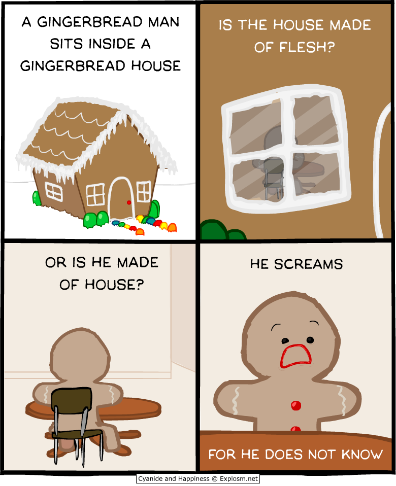

+++
title = "My 2023 Resolution"
date = 2023-01-01
description = "Goals and reflections heading into 2023, after a big year."
[taxonomies]
tags = ["personal", "goals"]
+++

## 1920x1080.

Jokes aside, 2022 has been a great year for me. I married the most perfect person for me, we moved to Prague, I have a close but special list of friends that I can talk to. Oh and I also went to a Men I Trust concert, that was great.

I'm saying great in the context of my other years though. It can be better, and I will try to make 2023 better for me. A few things that I want to achieve / improve in the upcoming year:

## Health
I think before anything I really need to focus on my general health. Without it, none of what I'm going to write next matters. As I'm writing this everything is melting around me. This is not something new, things've been going up and down for the past year, no thanks to all the stress of work, marriage procedures, mandatory military service stuff, moving to a new country etc.

#### Physical Health
If we subdivide this section, I would say physical health is the one thing I need to just not give up on this year. I've been struggling with weight loss for a loong time. My wife Sueda's been helping me a lot, thanks to her I was able to lose a few kilos here and there, but thanks to my stupid ADHD (I) brain, once I lose track I just go back to the way it was like nothing has changed. As of writing now, I'm right on the verge of around 99.8kg (At least when last I checked). I haven't checked again because I'm afraid of seeing 4 numbers there instead of 3.

So what am I going to do about it? Well first, I know that "I need to cut sweets and carbs and I'll give weight like nothing", but history has shown that I can't force myself to do that. Instead, I'd like to start doing the one thing that has consistently produced results for me - Fasting. Here's my January fasting schedule that will go into effect, open to public:

| Timeframe | Fasting Start | Fasting End |
|--|--|--|
| 1-7 Jan | Waking up | Afternoon |
| 8-14 Jan | 00:00 | Afternoon |
| 15-21 Jan | 22:00 | Afternoon |
| 21-30 Jan | 20:00 | Afternoon |

This is Intermittent Fasting btw, I will still drink as much water (only) as I want. By the end of January I should be settled down to the 16:8 schedule of fasting, will probably even push further on the upcoming months. Afternoon means my lunch break, usually is at 13:00 but can be a little later depending on the calls I get.

"But Arto" I hear you say, "Isn't that too easy? Are you even trying?" - Every time I've tried to take things too harsh and sudden on myself, I have failed. Slow and steady is the way to go. My goal for end of January is lose 2-3 kilos and end at 97. At least that's what Google tells me the healthy amount is. I will also try to count calories, I've seen that help me get discouraged from snacks at least.

#### Mental Health
\- Is a topic I've also been struggling with. Due to all the stress over me on the past year, I've gotten less like myself and I'm losing the "chill personality" I'd like to be known for. I get angry too easy, I've seen myself resorting to psychological tricks to others, I can't really control myself, I'm unmotivated, I get distracted too easily. What will I do about it? Honestly, I don't know. I'd like to seek therapy, but I'm in the process of trying to find an English speaking VZP (Czech Insurance) accepting practitioner, shit's expensive yo. [Here's a Reddit thread](https://www.reddit.com/r/Prague/comments/zxc18w/) that has some info on it. Sueda's been mentioning getting into meditation, but can I do that as well? My mind can't really sit in place, I'm actively repulsed to it. Maybe that's the whole idea with Meditation?

## Work
Alright enough about my health, I'll get it sorted, I promise. What about the stuff I want to _do_?

#### Rust / My Career
If you're in my circle, you probably have heard me talking about it. I mean this language is amazing - the speed of C++ while having the safety of Python and ease of use of Go? What more is there to want?

This is the year I learned about and first done something in Rust. It's hard, not going to lie, but I've been kinda going through it. I've read most of "[The Book](https://doc.rust-lang.org/book/)", I've watched tons of videos and read a lot of articles about it. This year was the one that Rust really caught traction, and I suspect it will be getting even more popular in the upcoming years. I think it's a good language to invest time / energy in. I even did some [Advent Of Code](https://adventofcode.com) this year with it.

"But Arto, aren't you working as a Networking type of guy?" Why yes, as a matter of fact I do. I'm working as a TAC Engineer in Fortinet as of now, which is a fancy way of saying I'm tech support. I kinda like this job - it's close to my house, ok work / life balance, ok pay, good stability. However, I'm just not excited about this job. On especially unmotivated days I've found myself almost not doing anything productive all day. That's why I'm looking for a software job. I'd like it to be a Rust one, but I'm also fine with a C# job if life drags me that way.

#### Projects
For the end of the article I'd like to just jot down a few projects I want to do. I've never written these down before, till now ideas mostly just come and go from my head.

* **Artodo**  
This is the first project that I ever projected, I even did some [actual work](https://github.com/artogahr/artodo) on it (wow). It's a "hello world" of a project, I mostly want to do it because I'll actually want to use it, since it's my own!!! This one's not actually a very serious one for me.

* **Text insertion / clipboard application**  
In my job I do a lot of stock text insertion, things like "Dear Customer, thank you for writing to Fortinet, ...". There's already an internal tool that helps somewhat, but I'd like to write something that I can completely customize.

* **A Website**  
I'm already using https://tilde.team/~artogahr/ as the website, should I do something that's my own?

I kinda want to do it because of Rust reasons, I think it could be a cool project to do something real and learn about Rust.

* **Torrent server**  
I already have a torrent server (A headless Thinkpad T450s with qBittorrent and Jellyfin running on it), and I would like to set up Sonarr, Lidarr and the like with them as well, to automate some work involved with it.

* **Social Media**  
Not really a project, but still something I would like to do something about. I have created a [Mastodon account on tilde.zone](https://tilde.zone/@artogahr), and I don't think I'll be using Twitter or alike for now, but you can also follow me as @artogahr everywhere.

## End Credits

Well that's it really, I don't think I have anything to add right now. I'm sitting in my house, alone, while there's New Year's Eve fireworks going on all around me (Prague _really_ likes fireworks), trying to watch "Asteriks ve Oburiks Sezara Karşı" with my wife over Discord. I'd like to thank her and all my friends that have supported me this year, and enabled me to come this far in life.

If you read this far I thank you for bearing with my first ever blog post, and wish you a very good year! Artout.
