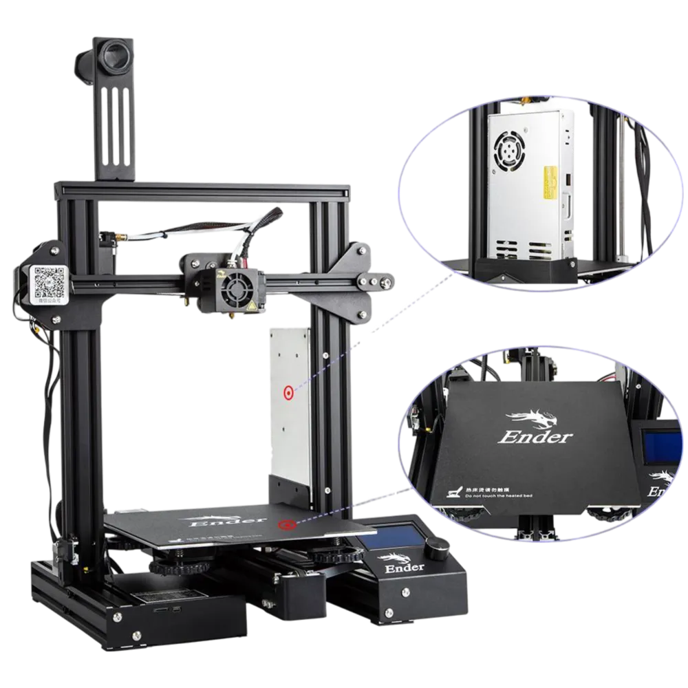

+++
title = "3D Printers: A Gentle Introduction"
date = 2023-08-07
description = "So you want to learn about 3D Printers or just print something? Here's a first stop to get you started."
[taxonomies]
tags = ["3d-printing", "hardware", "guide"]
+++

Hello! I'm Arto, and I've been into 3D printers as a hobby since 2018. During this time I've gotten many requests from people who want to get into the hobby or just want to print something, so I decided to write an article about it.

I'll try to keep this as short as possible. This is not a comprehensive guide at all, but a first stop to get you started. Here's a brief list of important topics if you want to jump around:
* [How 3D Printers Work](#how-3d-printers-work)
* [What you need to get started](#getting-started)
* [How to slice an STL file](#slicers)
* [Which material to pick](#materials)
* [What to change in the slicer](#slicer-settings)
* [Things you need to pay attention to](#important-details)
* [Frequently Asked Questions](#faq)

### How 3D Printers Work
There quite are a few types of 3D printers available, but by far the most common and the one we're going to focus on is FDM Printers. They generally have some mechanism to push plastic out of a hot nozzle and print something layer-by-layer. Here is a picture of Ender 3, a very popular entry-level FDM printer:

<figure>
    
    <figcaption>Ender 3 Pro, a very popular, cheap, entry-level hobbyist 3D Printer</figcaption>
</figure>

FDM Printers are remarkably simple machines. In essence, they're basically a combination of motors, belts and screws, controlled by a PCB that can only follow very simple instructions. They print one thin layer of plastic on the print surface, go up a tiny bit, print another thin layer of plastic, go up a tiny bit again, and so on... Imagine cutting a clay model of something into very thin horizontal slices, then putting them together again in the right order, thus constructing the original model again.

The instructions are usually in the form of a .gcode file that contains - you guessed it - GCODE. They are simple atomic instructions telling the printer to move a certain motor a certain amount, heat the nozzle to X degrees, extrude Y amount of plastic etc.

### Getting Started

To start printing, you'll need:
* A 3D Printer (obviously)
* Some filament
* An SD Card (with an adapter probably)
* A computer with a slicer application installed
* A 3D model file of the thing you want to print (most likely an .STL file). Below are some good places to get STLs:
    * [Printables](https://printables.com) (my favorite)
    * [Thingiverse](https://thingiverse.com)
    * [Thangs](https://thangs.com) (indexes all sites)

Once you have all these things, and the .gcode file inside the sd-card, just plug it in the printer, select the file from the printer's UI, and start printing!

### Slicers

To convert 3D Model files into GCODE files you're going to need software called "Slicers". They slice the file into layers, and algorithmically generate atomic GCODE instructions for them (hence the name "Slicer"). To simplify, there are two slicers that you need to worry about:

1. If you're using a Prusa printer: [Prusa Slicer](https://www.prusa3d.com/page/prusaslicer_424)
2. If you're using any other model of printer: [UltiMaker Cura](https://ultimaker.com/software/ultimaker-cura/)

Prusa's slicer does support most other printers - and Cura also supports Prusa printers as well. Generally I suggest Cura for beginners, since its UI is easier to work with. However I can't deny the extra features of Prusa Slicer can come handy at times :)

Both of these has similar installation procedures. Just don't do next-next-next without looking, the pages usually have useful information and important configuration steps (In general this is a good advice for anything, never press next without checking what you're agreeing to / selecting).

### Materials
There are a few things to look for when selecting a material. However if you're a beginner, just go with PLA. If PLA isn't available, PETG is your next best choice. Below I will explain general information about the most common materials and the safe spot temperatures for them. However there are many different filament manufacturers and their chemical compositions differ. Sometimes they list the best temperatures on the spool, or sometimes you can find preconfigured profiles for the brand/model of filament in your slicer. Use these instead of below temperatures if you can.

* PLA is easy to print, requires lower temperatures, is pretty durable and cheap. However its lower glass transition temperature also means it's not durable against heat, which means it can start losing shape in hot environments, such as under direct sunlight on a hot summer day. You can print PLA on any build surface. Good temperatures for PLA is 210°C Nozzle and 60°C build plate.

* PETG is very similar material to the PET bottles we use every day. It's also relatively easy to print, but requires higher temperatures and therefore more durable against heat. **DO NOT use bare smooth surfaces for PETG** (such as smooth PEI, glass etc.), sometimes it sticks *too well* and can rip chunks off your build plate. Use textured sheets instead, or you can also use a glue stick as a middle layer if you only have smooth surfaces. Good temperatures for PETG is 240°C Nozzle and 80°C build plate.

* ABS used to be pretty popular before PETG but is infamous for being hard to print with. It likes to curl up from build surfaces and requires a heated chamber. Use PETG if you have the choice. You can print ABS on any build surface, good luck :) Good temperatures for ABS is 240°C Nozzle and 80°C build plate.

### Slicer Settings
There are a few settings in your favorite slicer program that you'll need to know about. Here are the most commonly used ones in no particular order:

* **Nozzle Diameter** - Nozzles are interchangeable, and this setting is to tell the slicer how wide the hole in your nozzle is. The most common nozzle diameters are 0.4, 0.6 and 0.25mm. The wider the nozzle, the more plastic it can push through, therefore the faster printing is. However you need a smaller nozzle diameter to print really fine details. By far the most common nozzle diameter is 0.4mm. By default most printers come with this nozzle pre-installed.
* **Layer height** - This indicates how "thick" each layer is. Higher line height - faster prints but less surface detail. A good rule of thumb is to use (Nozzle diameter)/2 for the layer height. This means for a 0.4mm nozzle, 0.2mm layer height is the usual go-to. For prints with less detail, consider slightly increasing this to reduce printing time, or vice-versa.
* **Infill** - Usually the insides of a print isn't full of plastic or hollow, but there is some kind of plastic pattern to give some rigidity without wasting plastic. Default patterns and infill percentages are usually fine for most people. If you need strong prints, consider increasing this. 0% infill means a hollow print, 100% means the part comes out as solid plastic with no emptiness inside. 20% is a good amount for most prints.
* **Support** - As the printer prints each surface on top of the previous one, it's unable to print in air. It can't print the wing of a plane on top of air, for example. But this setting puts some plastic supports below the parts that hang in the air, and you can remove them after the print finishes.

### Important Details

#### Clean build surface
A dirty build surface is the most common cause of failed prints. Finger oils or other things can go between the filament and build surface, thus preventing them from sticking. Use Isopropyl Alcohol for cleaning. Or you can also just take the build plate off and use generic dish soap + warm water to clean as well, this is my preferred cleaning method.

#### Leveled build surface
Some printers have sensors to measure height of the build plate at different points. Prusa printers usually have them, and can compensate for slight differences in software. This is important as you want all of your build surface to be at the same height, so that the first layer can be properly deposited. Some other printers don't have these sensors, and you have to manually adjust screws to make sure all the corners are at the same height. Most budget Creality Ender printers work like this. If someone has already leveled it you most probably don't need to touch it, but if you do, your best bet is to go watch a YouTube video :)

#### Correct first layer height
As is the levelness of the bed, the Z height calibration of the nozzle is also important. Too high - and the filament won't get squished enough and won't stick to the surface. Too low - and the filament will push previous filament lines out - leading to inconsistent first layer surface at best or a scratched build surface at worst. Remember: the printer is a dumb machine, it will scratch, break or hit anything you tell it to!

For a printer with a Z height sensor, such as the Prusa printers, it's usually enough to calibrate it once. For cheaper printers, you may need to level the bed and calibrate the Z offset again once in a while. There usually is a menu in most printer's interfaces to adjust the Z offset. The Prusa MK4 can even calibrate Z height on its own!

### FAQ
* Have any questions? [Let me know :)](https://artogahr.bearblog.dev/contact-information)
