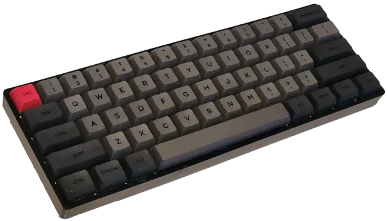
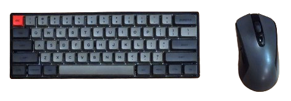

+++
title = "My Best (Non-Living) Friend"
date = 2024-07-19
description = "A love letter to a battered keyboard that has been there for every important moment."
[taxonomies]
tags = ["keyboards", "hardware", "personal"]
+++

Hi! This is my keyboard:

It... has issues, but still I love to the moon.

It's a Skyloong (Epomaker?) SK61, and there's nothing special about it. Plastic case, cheap PCB and chip, weird firmware, no wireless or anything. Gateron Optical switches (a mix of browns for the letters and reds for the surroundings). I got it a few years ago second hand, from <a href="https://sahibinden.com">the Turkish equivalent of Craigslist.</a>

The stabilizers were cut down with my wife's nail cutters. They were lubed with some Krytox I got for free in a keyboard meetup, and filled in with some other thicker lube that came free with my 3D Printer. Modded with cheap Flea Market™ bandaids. I used some weird sticker sided (?) foamish thing I found around the house to fill in the void, I don't even know where those came from. The case, keycaps, PCB, midplate and all are scratched and damaged beyond repair. Half the feet are missing (replaced with hot glue of course). The USB-C port is loose. The chinesium software for it doesn't even work under Linux. It has RGB LEDs, but I almost never use it. It doesn't sound or feel <i>that</i> good either.[^sound-feel]

Yet I love this thing to the moon. It was with me through every important career change. It was there while I was getting married. It was used to write every article, important piece of email, every AoC challenge, Jira ticket response, every corny joke that I made.

<a href="https://github.com/artogahr/dotfiles/blob/master/gk6x/config.txt">The keymap configuration I made for it</a> is so perfect, it has become an extension of myself, and I'm very efficient with it. Despite all the abuse, everything Just Works™, capiche?

I still take it with me to work every time. No protection or anything, just chuck it in there, y'know? Same with a Logitech G603 that's also a Turkish™ Craigslist™ special™, and that one's been through even worse, having gotten repaired at least 3 times by yours truly.

But they're beautiful in their own way, I honestly never want to replace them. I'm afraid I'll never love the next thing as much...

[^sound-feel]: It honestly sounds and feels really good <i>for me</i> though. I can not understate how lucky I feel to get a keyboard that satisfies me this much without going down the <a href="https://www.reddit.com/r/MechanicalKeyboards/top/?sort=top&t=all">Rabbit Hole™</a>
